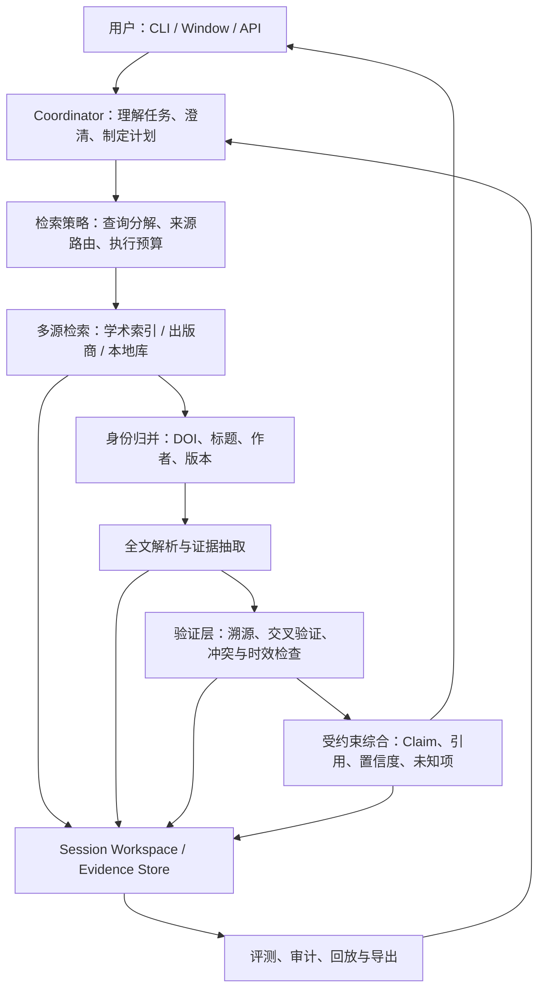

# LitTrace：可靠信息检索 Agent 架构说明

## 1. 项目背景与重新定位

LitTrace 当前是一个面向材料与化学研究的本地文献工作台：它能够检索论文、管理文献上下文、解析 PDF、抽取表格、生成研究脉络，并通过质量报告和评测工具检查产物。现有代码已经形成了 `Coordinator + ToolContract + Session Workspace + bounded LangGraph workflow` 的基础架构。

下一阶段建议将产品核心明确为：

> 一个以证据为中心、可追溯、可复现、会表达不确定性的可靠信息检索 Agent。

这里的“可靠”不等同于“搜索结果更多”或“模型回答更流畅”。它要求用户能够追问任一结论的来源、原文证据、检索时间、版本、冲突来源和验证状态；系统在证据不足时必须降级为“未知/待验证”，不能将候选信息包装为事实。

当前阶段仍应以学术文献为主场景。其 DOI、出版商页面、PDF、作者和发表时间等稳定标识，最适合先建立可靠性标准。以后扩展到专利、技术报告、网页或企业知识库时，复用同一套证据与验证模型，而不是重新设计 Agent。

## 2. 目标与边界

### 目标

- 对每个最终结论提供可点击、可定位的来源证据。
- 用多个独立来源交叉验证重要事实，明确记录一致与冲突。
- 将检索过程、原始响应、解析版本和模型版本保存为可回放的运行记录。
- 将“发现候选文献”和“证明答案成立”明确分开。
- 让用户能查看、筛选、纠正当前检索上下文，并以该上下文为事实来源。
- 通过固定评测集持续量化检索、证据绑定和答案真实性，而非只看模型主观效果。

### 非目标

- 不把多 Agent 角色对话作为主执行路径。
- 不将向量检索或 RAG 作为事实存储；它只能用于召回候选证据。
- 不自动绕过付费墙、登录、访问控制或站点限制。
- 不承诺所有主题都能得到唯一结论；对于分歧问题，应输出证据分歧和适用范围。

## 3. 可靠性的操作性定义

一个回答中的每个关键 Claim 必须满足以下分级规则：

| 等级 | 定义 | 可用于最终答案 |
| --- | --- | --- |
| `verified` | 有原始或权威来源、原文证据定位，且通过规则/模型校验 | 可以作为确定性表述 |
| `corroborated` | 至少两个独立来源支持，或一个权威原始来源强支持 | 可以表述，但附来源 |
| `supported` | 有可定位证据，但未完成交叉验证 | 仅可进入带证据缺口的草稿，不能用于最终答案或正式报告 |
| `candidate` | 仅搜索摘要、二手转述或未验证抓取结果 | 仅供候选列表，不能写成事实 |
| `conflicted` | 可靠来源间存在实质矛盾 | 必须展示矛盾与适用条件 |
| `unknown` | 没有足够的可用证据 | 明确说明未知，不生成推断性结论 |

重要结论的最低发布条件是：有 `EvidenceSpan`，其包含来源标识、原文片段、页码/章节/表格单元格定位、抓取时间和解析器版本；并且 Claim 状态为 `verified` 或 `corroborated`。仅有 DOI、URL 或模型摘要都不构成证据。

发布门禁必须执行，而不只是记录状态：未通过时，系统只能返回 `DRAFT - NOT FOR PUBLICATION` 的证据审阅稿和明确的缺口；不得导出 `research_report`、生成最终研究回答，或将草稿标记为可发布。对于需要交叉验证的数值 Claim，独立来源在规范化单位后偏差超过容差时必须标记为 `conflicted`，不能静默平均或挑选单一数值。

## 4. 总体架构



架构原则是单一编排者、稳定工具能力、结构化事实状态、独立质量门。`Coordinator` 负责决定下一步和何时向用户澄清；业务能力由有明确输入输出的 ToolContract 执行；事实、证据和运行记录写入 Workspace；验证器决定信息能否进入最终回答。

## 5. 分层设计

### 5.1 交互与任务编排层

对应现有模块：`src/littrace/coordinator.py`、`chat.py`、`intent.py`、`api/`、`cli.py`、`window.py`。

职责：

- 将用户问题转换为结构化 `ResearchTask`：主题、事实类型、时间范围、地域/学科范围、结果数量、证据要求。
- 处理模糊意图和风险较高的歧义，例如“最新”“最好”“证明”。
- 制定有限步骤的计划，并为每步设置时间、请求数、来源数和 token 预算。
- 只从验证层接收可发布 Claim；不能直接把工具输出或 LLM 草稿返回用户。

Coordinator 不应实现搜索、爬取、PDF 解析或引用核验细节，避免对话流程和领域逻辑彼此耦合。

### 5.2 检索与来源路由层

对应现有模块：`search.py`、`source_router.py`、`publisher_connectors.py`、`full_text.py`、`access.py`。

职责：

- 根据问题类型选择来源。论文元数据优先 Crossref、OpenAlex、Semantic Scholar；开放获取状态优先 Unpaywall；全文优先本地库、开放 PDF 和授权出版商路径。
- 生成多个可解释的查询变体，并记录每个查询、来源、页码/游标、请求时间和失败原因。
- 合并候选但不立即认定事实。检索输出只能是 `CandidateRecord`。
- 为每个来源配置超时、重试、限流、缓存 TTL 和健康度；单一来源失败不能让任务伪装成“没有结果”。

建议引入 `SourceAdapter` 接口，统一不同 API、网页和本地索引的返回格式及质量元数据。

### 5.3 身份归并与规范化层

对应现有模型和检索结果写入逻辑，可新增 `identity.py`。

同一论文可能同时出现在预印本、索引服务和出版商页面。归并顺序应为 DOI、PMID/arXiv ID 等稳定标识，随后才是规范化标题、作者、年份和期刊的模糊匹配。归并后保留每个来源版本，不覆盖原始字段。

该层应产出：

- `CanonicalWork`：稳定工作实体及其版本关系。
- `SourceRecord`：来源原始元数据、URL、抓取时间、内容哈希。
- `ResolutionDecision`：为何合并或拒绝合并的证据与置信度。

这一步是消除重复、错配 DOI 和错误年份的关键，也是后续引用可靠性的前提。

### 5.4 证据库与解析层

对应现有模块：`session.py`、`runtime/memory.py`、`parsing.py`、`ocr/docling_adapter.py`、`tables.py`。

Session Workspace 保持当前任务的事实源，但应进一步演进为以不可变工件为核心的 Evidence Store：

```text
session/
  task.json
  run.jsonl
  sources/
    <source-record-id>.json
  documents/
    <content-hash>/raw.pdf
    <content-hash>/parsed.json
    <content-hash>/parser-report.json
  evidence/
    spans.jsonl
    claims.jsonl
  artifacts/
    answer.md
    verification-report.json
  snapshots/
```

每个 `EvidenceSpan` 至少包含 `work_id`、`source_record_id`、原文、定位信息（页/节/表/行/列）、内容哈希、抓取时间、解析器及版本、抽取置信度。PDF 解析结果必须保存为结构化文档；回答只引用结构化证据的 ID，而非临时拼出的文本。

向量索引可以加入这一层，用于在已解析文档中召回候选片段。但最终引用必须回到原始文档定位，且需经过验证。

### 5.5 验证与质量门层

现有基础包括 `harnesses.py`、`golden_eval.py`、`retrieval_eval.py`、`quality_report.py` 和 `audit_citation_links_skill`。建议补齐以下独立验证器：

| 验证器 | 负责问题 | 阻断条件 |
| --- | --- | --- |
| `SourceVerifier` | URL 可访问、来源身份和时间是否真实 | 来源不可解析或身份不明 |
| `CitationVerifier` | Claim 是否真正被引用片段支持 | 只有链接、没有证据定位 |
| `CrossSourceVerifier` | 关键事实是否有独立佐证 | 高风险 Claim 仅有弱单源 |
| `ContradictionDetector` | 来源间数值、结论、范围是否冲突 | 冲突被静默合并 |
| `FreshnessVerifier` | “最新”“截至某日”等时效性表述 | 缺少检索截止时间或窗口 |
| `ExtractionVerifier` | 表格数值、单位、条件、页码是否完整 | 值脱离单位、实验条件或来源 |

质量门的输出不是简单分数，而是 `VerificationReport`：每项 Claim 的状态、证据、失败原因、可修复步骤和剩余风险。最终回答生成器只消费 `verified` 与 `corroborated` Claim；`supported` 只能在草稿中以待补证形式展示。

### 5.6 综合与回答层

综合器的输入应是结构化 Claim 集合，而不是原始搜索结果或整篇 PDF。回答至少需要分开呈现：

- 已证实的结论及内联引用；
- 证据不足或来源冲突的部分；
- 检索范围、截止时间、来源数量和未覆盖项。

对比较表格，每个单元格都应能追溯至 `EvidenceSpan`，保留单位、样品/实验条件和置信度。对“发展脉络”类回答，应将因果表述限制在证据能支持的范围内，避免把时间先后写成因果关系。

### 5.7 评测、观测与回放层

对应现有的 `eval/`、`golden_eval.py`、`harnesses.py`、`tracing.py`、`workflow_parts/tracing.py`。

每次运行应记录完整决策链：用户任务、计划、查询、来源响应摘要、归并结果、工具版本、模型版本、验证结论和最终 artifact 哈希。以此支持回放、回归测试和故障定位。

建议将以下指标纳入持续评测：

- 检索：Recall@K、nDCG、重复率、有效 DOI 比例、来源覆盖率。
- 证据：带精确定位的 Claim 比例、citation precision/recall、悬空引用率。
- 真实性：Claim 支持率、冲突披露率、无证据断言率。
- 时效与稳定性：过期来源率、来源失败可见率、相同输入的结果漂移。
- 效率：端到端耗时、每个已验证 Claim 的请求数/成本、缓存命中率。

## 6. 标准执行流程

```text
1. 解析任务与约束；不足以执行时先澄清。
2. 生成检索计划：查询变体、来源、预算、最低证据要求。
3. 并行检索多个来源，保存原始结果和运行元数据。
4. 归并工作实体，标注版本、重复和不确定身份。
5. 获取可合法使用的全文或摘要，解析为可定位结构化文档。
6. 为问题抽取候选 EvidenceSpan，并生成原子 Claim。
7. 运行来源、引用、交叉验证、冲突和时效验证器。
8. 根据验证等级构造回答、表格或报告；显式写出未知与冲突。
9. 写入 VerificationReport、可回放 trace 和最终 artifact。
```

对于耗时或需登录的步骤，流程应暂停并返回可继续的状态，不应在后台静默改变工作区。对于网络失败，应返回“来源不可用”的诊断，不能与“该主题没有文献”混为一谈。

## 7. ToolContract 演进建议

现有 `ToolContract` 已具备版本、网络权限、工作区变更和副作用声明。建议增加以下字段或等价模型：

- `idempotency`: 是否可安全重试。
- `cache_policy`: 缓存键、TTL、是否允许陈旧读取。
- `provenance_outputs`: 该工具产生哪些 SourceRecord、EvidenceSpan 或 Artifact。
- `quality_requirements`: 输出进入下一阶段前必须满足的验证器。
- `failure_class`: `transient`、`source_unavailable`、`invalid_input`、`policy_blocked` 等。
- `budget_cost`: 请求、时间、金钱或 token 的预估消耗。

优先形成以下稳定工具面：

```text
plan_retrieval_task
search_source
resolve_work_identity
fetch_authorized_content
parse_document
extract_evidence_spans
verify_claims
detect_conflicts
compose_grounded_answer
export_verification_bundle
```

工具返回大内容时继续采用 `output_ref` 指向工件，而不是把全文放进 Agent 上下文。这样既能控制 token，也能防止模型在未验证文本上自由发挥。

## 8. 与现有代码的映射

| 已有能力 | 在目标架构中的位置 | 建议 |
| --- | --- | --- |
| `coordinator.py` | 任务编排层 | 保持单 Coordinator，增加 `ResearchTask` 与发布策略 |
| `workflow.py` | 有界状态机 | 仅编排固定检索流水线，不承载所有产品逻辑 |
| `tool_contracts.py` / `skill_runner.py` | 受控工具执行层 | 扩展证据、预算、缓存和失败语义 |
| `search.py` / `source_router.py` | 多源检索层 | 抽象 `SourceAdapter`，统一诊断和分页记录 |
| `full_text.py` / CDP 下载模块 | 合规内容获取层 | 将访问状态、许可和失败原因结构化写入 Workspace |
| `parsing.py` / `ocr/` / `tables.py` | 证据抽取层 | 强制页码、表格单元格、单位和解析器版本 |
| `session.py` / `runtime/memory.py` | 工作区与短期状态 | 让 Evidence Store 成为事实源，Memory 只保存压缩视图 |
| `harnesses.py` / `golden_eval.py` | 质量门与评测层 | 将评测从“报告”提升为发布门禁 |

## 9. 推荐落地顺序

### Phase 1：把可追溯性做实

1. 为搜索结果、全文、解析文档和表格单元格建立统一 ID 与内容哈希。
2. 实现 `EvidenceSpan`、`Claim`、`VerificationReport` 三个核心模型，并在答案和导出中落盘。
3. 将现有 citation/link audit 改为 Claim 级质量门：无证据定位的关键结论不可发布。
4. 在 UI/API 返回检索时间、来源失败、解析状态和引用定位。

完成标准：任意最终结论都能从 artifact 反查到原始来源与精确片段。

### Phase 2：把多源验证做稳

1. 建立 `SourceAdapter` 和来源健康度、限流、缓存、错误分类机制。
2. 实现 DOI 优先的身份归并与版本关系保存。
3. 加入关键 Claim 的交叉验证和冲突检测，支持输出相互矛盾的结果。
4. 在 golden eval 中加入错误 DOI、重复论文、过期网页、冲突数值和来源宕机样例。

完成标准：系统能解释“为什么相信这条信息”，也能解释“为什么暂时不能相信”。

### Phase 3：让 Agent 更自主但不失控

1. 在 Coordinator 中加入预算感知的规划与有限重规划。
2. 用 LangGraph 记录可恢复状态，支持网络失败、登录等待和人工补充 PDF 后继续执行。
3. 建立可回放运行包和 CI 回归阈值，防止模型/来源变化降低真实性。
4. 再考虑扩展专利、标准、技术网页等来源；先复用证据模型，再增加适配器。

完成标准：Agent 能在明确边界内自主完成多步检索，同时所有外部事实仍可审计。

## 10. 架构决策

- 保留单 Coordinator：当前任务是工具驱动的研究流水线，多 Agent 协商会增加状态与调试复杂度，未必提升事实可靠性。
- 保留 LangGraph，但限定为有界工作流：它适合重试、分支和恢复，不应成为领域逻辑与事实存储。
- 先做 Evidence Store，再做 RAG：可靠性首先依赖原始证据、定位和验证；向量检索只解决“从哪里找”。
- 将评测设为发布门：没有证据绑定与回归样例的“效果提升”不可视为产品能力提升。
- 让不确定性成为正式输出：真实世界的信息源会缺失、过期、矛盾或不可访问，系统应暴露这些限制。

## 11. 最小成功标准

在论文检索场景中，第一版可靠信息检索 Agent 至少应达到：

- 每个关键结论 100% 带来源和可定位证据。
- 关键数值 100% 带单位、实验条件/上下文和原始表格或页码引用。
- 对来源失败、冲突或证据不足的情况 100% 显式披露，不将其写成否定结论。
- 同一任务的运行包可在同一数据快照下回放并解释差异。
- 每次合并前运行固定 golden eval，检索质量、证据覆盖和真实性指标不得低于基线。

这套架构的价值不在于让 Agent 看起来更“聪明”，而在于让它的每一步推断都能被研究者检查、复用和反驳。对于科研信息检索，这是长期可积累的产品能力。
